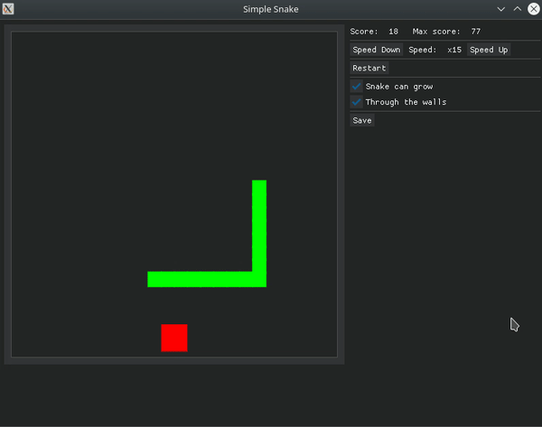

# Snake



The simplest implementation of the snake game.
It isn't framework-depended and you can reuse `snake_util.SnakeBody` class as you wish.

# Controls
* Direction: `WASD` + arrow keys
* Pause: `Spacebar`
* Speed Up/Down: `PgUp`/`PgDn`

# Installation
```commandline
$ python -m venv .venv
$ . .venv/bin/activate
$ pip install -r requirements.txt
$ deactivate
```

# Start
```commandline
$ . .venv/bin/activate
$ python snake_game.py
```

# Settings
See `data/snake.toml`


# License
MIT License

# Thanks 
to RahulShagri an his https://github.com/RahulShagri/OG-Snake-Game for inspiration