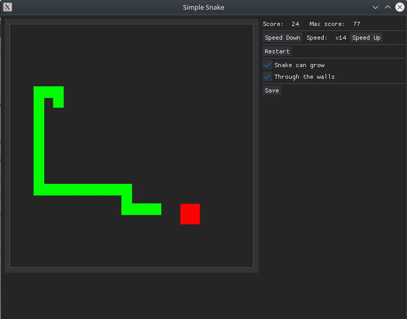

The simplest implementation of the snake game.

# Installation
```commandline
$ python -m venv .venv
$ . .venv/bin/activate
$ pip install -r requirements.txt
$ deactivate
```

# Start
```commandline
$ . .venv/bin/activate
$ python snake_game.py
```

# Settings
See `data/snake.toml`

# Controls
* Direction: `WASD` + arrow keys
* Pause: `Spacebar`
* Speed Up/Down: `PgUp`/`PgDn`

# Screenshot




Thanks RahulShagri an his https://github.com/RahulShagri/OG-Snake-Game for inspiration


# License
MIT License